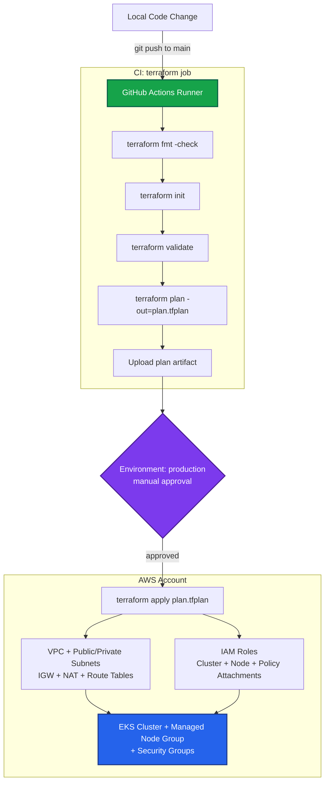
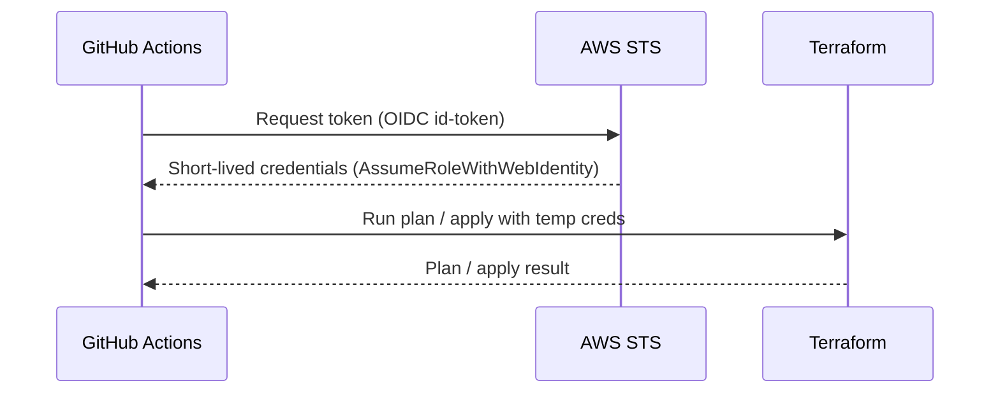

# Automated Infrastructure-as-Code Deployment Pipeline (`iac-deployment-pipeline`)

Enterprise-oriented platform engineering repository that provisions a secure multi-tier AWS network and a managed **EKS** compute cluster using **modular Terraform**, wired to a **GitHub Actions** CI/CD pipeline that authenticates to AWS via **OIDC** (no long-lived keys).

> **Portfolio mode — safe by default.** This repo is intended as a demonstration. All helper scripts that would create real cloud or GitHub resources are dry-run by default and only print the actions they *would* take. They require an explicit `--execute` flag to make any changes. Running `terraform apply` (locally or via the gated CI job) is the only path that provisions real infrastructure.

---

## Architecture Topology



The GitHub Actions credential step assumes an AWS IAM role via OIDC, keeping the pipeline free of static secrets:



---

## What gets provisioned

The root module in [terraform/main.tf](terraform/main.tf) composes three purpose-built modules:

| Module | Path | Resources |
| --- | --- | --- |
| **vpc** | [terraform/modules/vpc](terraform/modules/vpc/main.tf) | `aws_vpc`, public + private `aws_subnet`, `aws_internet_gateway`, `aws_eip` + `aws_nat_gateway`, public/private `aws_route_table` + associations |
| **iam** | [terraform/modules/iam](terraform/modules/iam/main.tf) | EKS cluster role (`AmazonEKSClusterPolicy`, `AmazonEKSServicePolicy`) and node role (`AmazonEKSWorkerNodePolicy`, `AmazonEC2ContainerRegistryReadOnly`, `AmazonEKS_CNI_Policy`) |
| **eks** | [terraform/modules/eks](terraform/modules/eks/main.tf) | `aws_eks_cluster`, `aws_eks_node_group` (t3.medium, 1–2 nodes), cluster + node `aws_security_group` |

Module inputs are threaded through in [terraform/main.tf](terraform/main.tf): the IAM role ARNs feed the EKS cluster/node group, and the VPC subnet IDs feed the cluster networking.

---

## System stack & dependencies

- **Infrastructure:** Terraform `>= 1.5.0` (CI pins `1.7.0`)
- **Provider:** `hashicorp/aws` `~> 5.0`
- **Cloud:** Amazon Web Services (default region `eu-west-2`)
- **CI/CD:** GitHub Actions with OIDC (`aws-actions/configure-aws-credentials@v3`, `hashicorp/setup-terraform@v3`)
- **Application:** Node.js 20 + Express sample service ([app/](app/src/app.js)) with a multi-stage Docker build
- **Container CI:** Docker Buildx with GitHub Actions layer caching (`docker/build-push-action@v6`, `cache-from/cache-to: type=gha`)
- **Testing:** [Jest](https://jestjs.io/) unit + route tests ([app/tests](app/tests/app.test.js)) run in CI; [Terratest](https://terratest.gruntwork.io/) skeleton (plan-only) in [tests/terratest](tests/terratest/main_test.go)

---

## Repository layout

```
iac-deployment-pipeline/
├── .github/
│   ├── workflows/
│   │   ├── deploy.yml            # CI: fmt/init/validate/plan + gated apply (OIDC)
│   │   └── app-ci.yml            # CI: Jest tests + multi-stage Docker build (layer cached)
│   └── create-environment.sh     # Create GitHub 'production' environment (dry-run by default)
├── app/
│   ├── src/                      # Express service (app.js + server.js)
│   ├── tests/                    # Jest unit + route tests
│   ├── Dockerfile                # Multi-stage build (deps → test → prod-deps → runtime)
│   ├── .dockerignore
│   └── package.json
├── terraform/
│   ├── main.tf                   # Root module — composes vpc + iam + eks
│   ├── variables.tf              # Root input variables
│   ├── outputs.tf                # Root outputs
│   ├── backend.tf                # Commented S3 + DynamoDB remote-state example
│   ├── backend-stack.yml         # CloudFormation to create the state bucket + lock table
│   ├── deploy-backend-stack.sh   # Deploy backend-stack.yml (dry-run by default)
│   ├── create-backend.sh         # Create S3/DynamoDB via AWS CLI (dry-run by default)
│   ├── terraform.tfvars.example  # Sample variable values
│   ├── README-modules.md         # Module overview
│   └── modules/
│       ├── vpc/                  # Network: VPC, subnets, IGW, NAT, route tables
│       ├── iam/                  # IAM roles + managed policy attachments
│       └── eks/                  # EKS cluster, node group, security groups
├── tests/
│   └── terratest/                # Go plan-only test skeleton
├── .gitignore
└── README.md
```

---

## Input variables

Defined in [terraform/variables.tf](terraform/variables.tf). See [terraform/terraform.tfvars.example](terraform/terraform.tfvars.example) for a sample.

| Variable | Default | Description |
| --- | --- | --- |
| `region` | `eu-west-2` | AWS region |
| `cluster_name` | `platform-core-production-cluster` | EKS cluster name (also used to name IAM roles) |
| `ssh_key_name` | *(required)* | EC2 SSH key for node-group remote access |
| `vpc_cidr` | `10.0.0.0/16` | VPC CIDR |
| `public_subnet_cidr` | `10.0.1.0/24` | Public subnet CIDR |
| `private_subnet_cidr` | `10.0.2.0/24` | Private subnet CIDR |
| `tags` | `{ Environment = "Production", Owner = "platform-team" }` | Common resource tags |
| `remote_state_bucket` | placeholder | S3 bucket for remote state (used only when backend enabled) |
| `remote_state_dynamodb_table` | placeholder | DynamoDB lock table (used only when backend enabled) |

## Outputs

From [terraform/outputs.tf](terraform/outputs.tf): `vpc_id`, `public_subnet_id`, `private_subnet_id`, `eks_cluster_role_arn`, `eks_node_role_arn`, and a `cluster_kubeconfig_placeholder`. The root also re-exports `cluster_name` and `cluster_endpoint`.

---

## Local usage

Validate the configuration without touching any AWS account:

```bash
cd terraform
terraform fmt -check
terraform init -backend=false
terraform validate
```

Preview a plan (requires AWS credentials + a valid `ssh_key_name`; this reads from AWS but creates nothing):

```bash
cp terraform.tfvars.example terraform.tfvars   # then edit values (set your ssh_key_name)
terraform plan
```

Apply (creates real, billable AWS resources — including a NAT Gateway and EKS cluster):

```bash
terraform apply
```

> `ssh_key_name` has no default and must be provided. The NAT Gateway and EKS control plane incur ongoing cost while they exist.

---

## Remote state backend (optional)

A remote backend keeps state shared and locked for team use. It is intentionally **commented out** in [terraform/backend.tf](terraform/backend.tf) so nothing runs against your account by accident.

To enable it:

1. Create the S3 bucket + DynamoDB lock table (choose one, both dry-run by default):
   ```bash
   cd terraform
   ./create-backend.sh <bucket-name> <lock-table> --execute
   # or via CloudFormation:
   ./deploy-backend-stack.sh <stack-name> <bucket-name> <lock-table> --execute
   ```
2. Fill in the bucket/table names and uncomment the `backend "s3"` block in [terraform/backend.tf](terraform/backend.tf).
3. Re-initialize: `terraform init`.

---

## CI/CD pipeline

Defined in [.github/workflows/deploy.yml](.github/workflows/deploy.yml). On push to `main`:

1. **`terraform` job** — checkout, setup Terraform, assume AWS role via OIDC, then `fmt -check` → `init` → `validate` → `plan -out=plan.tfplan`, and upload the plan as an artifact.
2. **`apply` job** — depends on the plan job, targets the `production` GitHub Environment (add required reviewers to gate it), downloads the plan artifact, and runs `terraform apply plan.tfplan`.

### Required repository configuration

- **Secret** `AWS_ROLE_TO_ASSUME` — ARN of an IAM role that trusts GitHub's OIDC provider.
- **Environment** `production` — create it and add reviewers to require manual approval before apply:
  ```bash
  ./.github/create-environment.sh --execute   # dry-run without --execute
  ```

---

## Application service & container build

A small Node.js 20 + Express service lives in [app/](app/src/app.js) to demonstrate the containerized delivery path that sits alongside the infrastructure pipeline.

Run the app locally:

```bash
cd app
npm ci
npm start          # serves on http://localhost:3000  (/, /healthz, POST /sum)
```

### Multi-stage Docker build

[app/Dockerfile](app/Dockerfile) is split into four stages so that expensive layers are cached and the shipped image stays minimal:

1. **deps** — `npm ci` against `package*.json` only, so the dependency layer is reused whenever manifests are unchanged.
2. **test** — runs the Jest suite during the build; a failing test fails the image build.
3. **prod-deps** — `npm ci --omit=dev` for a lean runtime dependency set.
4. **runtime** — copies only production `node_modules` + `src` into a slim `node:20-alpine` image running as the non-root `node` user.

```bash
cd app
docker build -t platform-core-service:local .
docker run --rm -p 3000:3000 platform-core-service:local
```

### Container CI with layer caching

[.github/workflows/app-ci.yml](.github/workflows/app-ci.yml) runs on changes under `app/`:

- **test job** — `actions/setup-node` (with npm cache) → `npm ci` → `npm test` (Jest).
- **build job** — Docker Buildx builds the multi-stage image with `cache-from`/`cache-to: type=gha`, so unchanged dependency layers are restored from the GitHub Actions cache instead of rebuilt on every run.

## Infrastructure testing

A plan-only [Terratest](https://terratest.gruntwork.io/) skeleton lives in [tests/terratest/main_test.go](tests/terratest/main_test.go). It exercises `terraform init`/`plan` without applying:

```bash
cd tests/terratest
go test -v -timeout 30m
```

---

## Security & hardening notes

- **No static cloud credentials** — CI uses OIDC short-lived tokens.
- **Private egress via NAT** — private subnet routes outbound through a NAT Gateway; the public subnet routes through the Internet Gateway.
- **Least-privilege IAM** — roles attach only the AWS-managed policies EKS requires.
- **Gated production apply** — protect the `production` environment with required reviewers.
- Consider adding: multi-AZ subnets for HA, `endpoint_private_access` on the EKS control plane, and encrypted secrets/KMS for state.

---

Files audited: [terraform/main.tf](terraform/main.tf), [terraform/variables.tf](terraform/variables.tf), [terraform/outputs.tf](terraform/outputs.tf), [terraform/modules/vpc/main.tf](terraform/modules/vpc/main.tf), [terraform/modules/iam/main.tf](terraform/modules/iam/main.tf), [terraform/modules/eks/main.tf](terraform/modules/eks/main.tf), [.github/workflows/deploy.yml](.github/workflows/deploy.yml).
